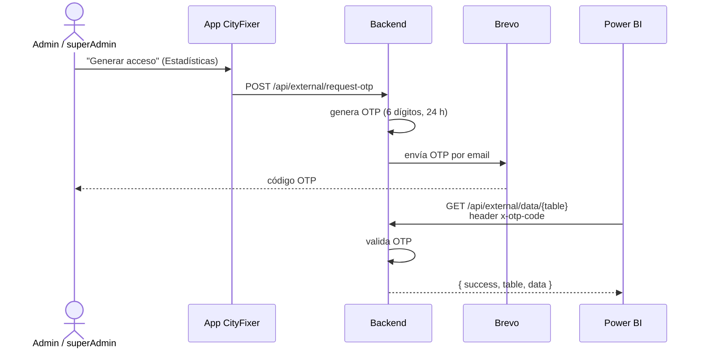

# Acceso a los datos desde Power BI

> Guía paso a paso para que un `admin` o `superAdmin` conecte Power BI Desktop
> a los datos de CityFixer. Endpoint y auth en `routes/external.routes.js`,
> `middlewares/externalAuth.js` y `services/external.service.js`.

## 1. Generar el código de acceso (OTP)

1. Entrar al panel admin → pestaña **Estadísticas** → tarjeta **"Acceso externo
   — Power BI"** (visible para `admin` y `superAdmin`).
2. Click en **"Generar acceso"**. Llega un código de 6 dígitos al email del
   usuario que lo pidió.
3. Ese código es el que se usa en Power BI (ver paso 3).



**Notas del OTP:**
- Válido **24 horas** desde que se genera.
- Pedir uno nuevo **invalida** el anterior (si no fue usado).
- La UI tiene un cooldown de 5 min para reenviar el email (no es la expiración
  del código, solo limita el reenvío).
- Ya **no** hace falta ninguna API key — antes se pedía `x-api-key` +
  `SCOPE_API_KEY`, eso se eliminó; ahora alcanza con el OTP.

## 2. El endpoint

```
GET /api/external/data/{table}
Header: x-otp-code: <código de 6 dígitos>
```

- **Base URL**: en local, `http://localhost:3000`; en producción, la URL donde
  esté desplegado el backend.
- **`table`** (uno por request): `groups` | `incidents` | `statusHistory` |
  `statuses` | `categories` | `neighborhoods` | `users`.
- Respuesta: `{ success: true, table: "<nombre>", data: [ {...}, {...} ] }`.

## 3. Configurar en Power BI Desktop

Power BI no deja poner headers custom en el asistente simple de **Obtener
datos → Web**, así que conviene armar la consulta en Power Query (editor
avanzado) usando un **parámetro** para el OTP — así, cuando el código venza,
alcanza con actualizar un parámetro en vez de tocar cada query.

1. **Inicio → Administrar parámetros → Nuevo parámetro**: nombre `OTPCode`,
   tipo Texto, valor = el código recibido por email.
2. Por cada tabla, **Nueva consulta → Consulta en blanco** y pegar en el editor
   avanzado (ajustando `table` y la base URL):

   ```m
   let
       url = "http://localhost:3000/api/external/data/groups",
       Source = Json.Document(
           Web.Contents(url, [Headers=[#"x-otp-code" = OTPCode]])
       ),
       data = Source[data],
       toTable = Table.FromList(data, Splitter.SplitByNothing(), null, null, ExtraValues.Error),
       expanded = Table.ExpandRecordColumn(
           toTable, "Column1",
           List.Distinct(List.Combine(List.Transform(toTable[Column1], Record.FieldNames)))
       )
   in
       expanded
   ```

3. Repetir para `incidents`, `statusHistory`, `statuses`, `categories`,
   `neighborhoods`, `users` (mismo patrón, cambia solo el segmento final de la URL).
4. **Actualizar**: al refrescar el reporte, Power BI vuelve a pedir los datos
   con el mismo `OTPCode`. Cuando el OTP venza (401), generar uno nuevo desde
   la app y actualizar el valor del parámetro `OTPCode`.

## 4. Tablas disponibles

| Tabla | Columnas principales |
|---|---|
| `groups` | `id`, `status`, `category`, `neighborhood`, `representativeId`, `priority`, `incidentCount`, `isEmergency`, `isArchived`, `lat`, `lng`, `finalizedAt`, `createdAt` |
| `incidents` | `id`, `groupId`, `title`, `description`, `status`, `category`, `aiSuggestedCategory`, `isDubious`, `isCancelled`, `isEmergency`, `lat`, `lng`, `userName`, `userEmail`, `userDni`, `createdAt` |
| `statusHistory` | `id`, `groupId`, `status`, `changedAt`, `changedById`, `source` (`user`/`admin`/`ai`/`system`), `orden` |
| `statuses` | `id`, `name`, `description` |
| `categories` | `id`, `name`, `description` |
| `neighborhoods` | `id`, `name`, `centroidLat`, `centroidLng` |
| `users` | `id`, `firstName`, `lastName`, `email`, `dni`, `telefono`, `role`, `ciudad`, `barrio`, `provincia`, `profileComplete`, `isBanned`, `createdAt` |

**Relación sugerida en el modelo de Power BI:** `incidents.groupId` y
`statusHistory.groupId` → `groups.id` (uno a muchos). `changedById` en
`statusHistory` → `users.id` (incluye al usuario de sistema de la IA en las
transiciones con `source: "ai"`). `status` y `category` ya vienen como texto
legible en `groups` e `incidents`, no hace falta relacionarlas con las tablas
`statuses`/`categories` salvo que se quiera normalizar el modelo.

## 5. Seguridad y privacidad

- `incidents` y `users` traen datos personales (email, DNI, teléfono). Tratar
  el `.pbix` y cualquier reporte publicado con el mismo cuidado que cualquier
  dato sensible — no compartirlo fuera del equipo autorizado.
- Cada request queda registrado en los logs del backend con IP y tabla
  solicitada, para auditoría (`external.getData` en `utils/logger.js`).

## 6. Troubleshooting

| Error | Causa | Solución |
|---|---|---|
| `401 Se requiere el código OTP en el header x-otp-code.` | Falta el header en la consulta de Power Query | Revisar que el `Headers=[#"x-otp-code" = OTPCode]` esté bien escrito |
| `401 Código inválido o expirado.` | El OTP venció (24 h) o se generó uno nuevo que lo reemplazó | Pedirle a un admin/superAdmin que genere un OTP nuevo y actualizar el parámetro `OTPCode` |
| `400 Tabla inválida...` | Nombre de tabla mal escrito en la URL | Usar exactamente: `groups`, `incidents`, `statusHistory`, `statuses`, `categories`, `neighborhoods` o `users` |
| El botón "Generar acceso" no aparece / da 403 | El usuario no tiene rol `admin` o `superAdmin` | Pedirle a un `superAdmin` que le asigne el rol desde Usuarios |
