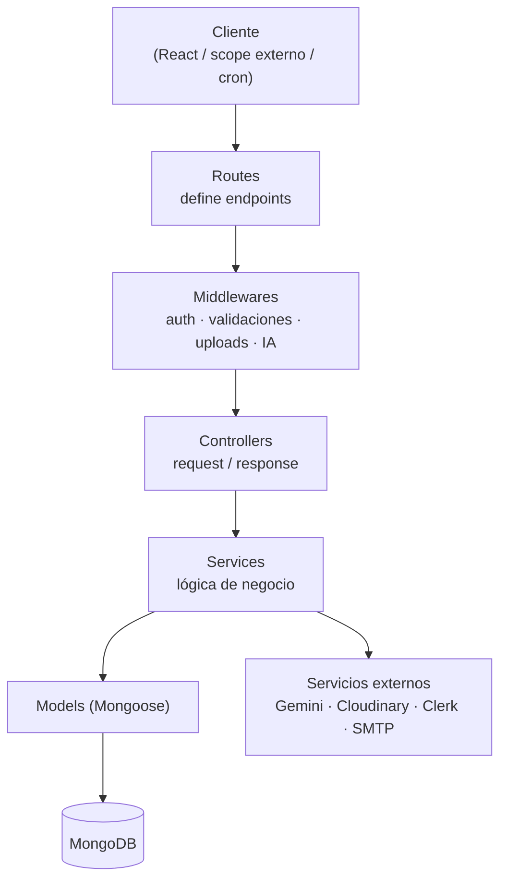
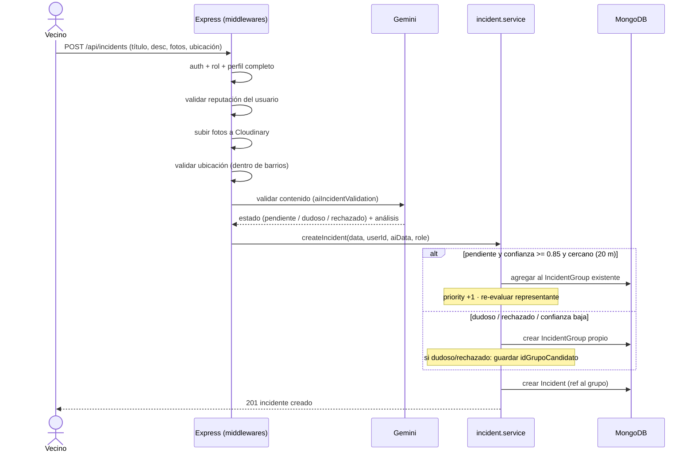
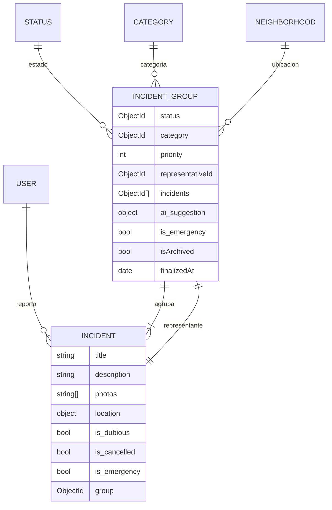

# Arquitectura — CityFixer

> Los diagramas Mermaid de este archivo se renderizan automáticamente en GitHub.

## 1. Visión general por capas

El backend sigue una arquitectura en capas (MVC + servicios). Cada request
atraviesa las capas de afuera hacia adentro; la lógica de negocio vive en los
**services**, no en los controllers.

**Responsabilidad de cada capa**

| Capa | Carpeta | Responsabilidad | No debe |
|------|---------|-----------------|---------|
| Routes | `routes/` | Mapear URL + método a un controller y encadenar middlewares | Tener lógica |
| Middlewares | `middlewares/` | Auth, roles, validación de entrada, subida de fotos, IA | Acceder a la DB directamente |
| Controllers | `controllers/` | Leer el request, llamar al service, responder | Tener lógica de negocio |
| Services | `services/` | Reglas de negocio y acceso a datos vía models | Conocer `req`/`res` |
| Models | `models/` | Esquemas y validaciones de datos | Tener lógica de aplicación |

## 2. Autenticación (doble esquema)

El proyecto convive con **dos mecanismos de autenticación**. Es importante
tenerlo presente al leer las rutas:

- **Clerk** — `clerkMiddleware()` está montado globalmente en `index.js`.
- **JWT propio** — `authMiddleware` / `verifyToken` validan un token firmado con
  `JWT_SECRET` y cargan el usuario de la base en `req.dbUser`.
- **Externo** — `externalAuth` valida `SCOPE_API_KEY` para las integraciones por
  scope externo.

Los roles se verifican con `verifyRole('user', 'admin', 'superAdmin')` después de
autenticar.

## 3. Flujo de un reporte de incidente

Recorrido de un `POST /api/incidents` desde que el vecino envía el reporte hasta
que queda agrupado. La cadena de middlewares es real (ver
`routes/incident.routes.js`).

> **Regla clave:** el agrupamiento automático solo ocurre para reportes en estado
> `pendiente`, con confianza de la IA `>= 0.85` y proximidad geográfica (~20 m).
> El umbral y este modelo de grupos están documentados como decisiones en los
> [ADRs](adr/README.md) ([ADR-001](adr/001-incidentgroup-fuente-de-verdad.md) y
> [ADR-002](adr/002-umbral-agrupamiento-ia.md)).

## 4. Modelo de datos (núcleo)

El sistema gestiona **grupos de incidentes** (`IncidentGroup`), no incidentes
sueltos. El grupo es la fuente de verdad para `status`, `category` y `priority`;
el `Incident` es el aporte individual e inmutable de cada vecino.

**Conceptos a recordar**

- `Incident.group` es **obligatorio**: todo incidente pertenece siempre a un grupo.
- `is_dubious` es un *flag*, no un estado: el vecino ve "pendiente", el admin ve el flag.
- `is_cancelled` excluye al incidente de la propagación de estado del admin.
- `ai_suggestion.idGrupoCandidato` guarda el grupo destino para un futuro merge de dudosos.
