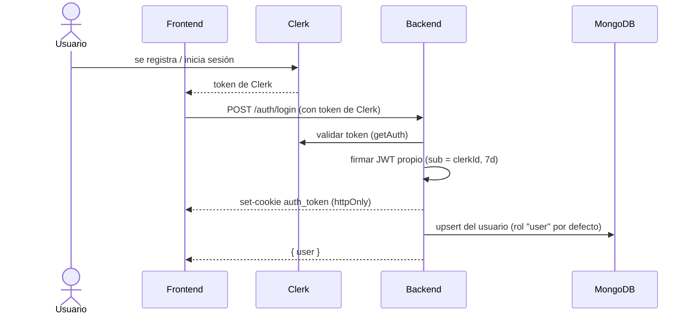
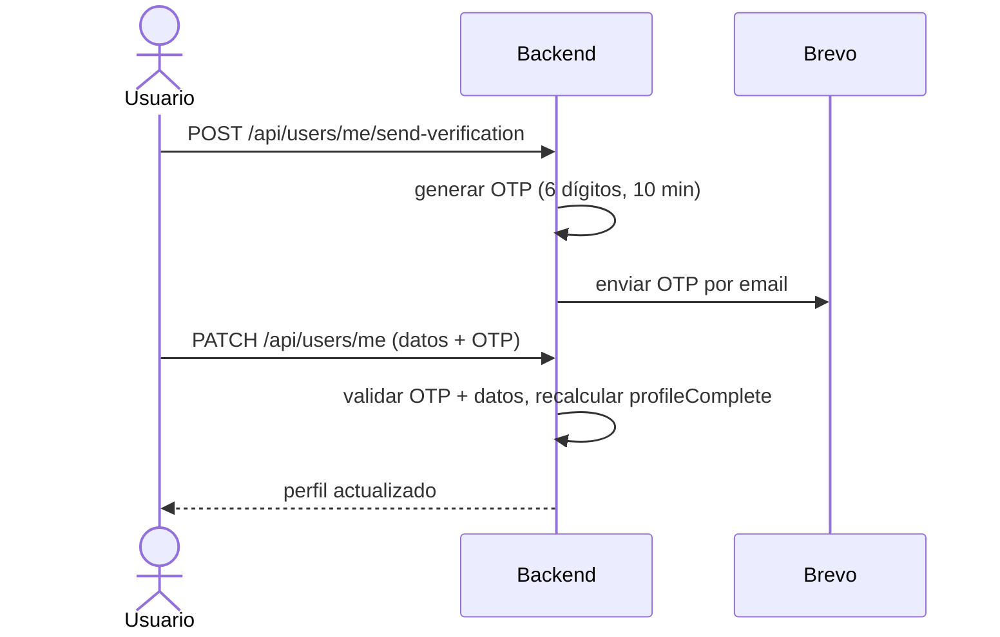

# Autenticación y onboarding

> Por qué hay dos sistemas de auth y cómo es el recorrido de un usuario desde
> que se registra hasta que puede reportar.

## Por qué Clerk + JWT propio

- **Clerk** maneja el registro/login real (formularios, contraseñas, OAuth). El
  frontend habla con Clerk y obtiene un token de Clerk.
- **JWT propio** es la sesión que usa el backend para todo lo demás. En el login,
  el back valida el token de Clerk **una sola vez** y emite su propio JWT, que
  viaja como cookie `auth_token` (httpOnly, 7 días).

Así, el resto de los endpoints no dependen de Clerk en cada request: validan el
JWT propio de la cookie. Es más rápido y desacopla la API del proveedor de auth.

## Flujo de login / registro

Detalles (`middlewares/verifyToken.js`, `controllers/auth.controller.js`):

- `verifyToken` valida el token de Clerk y setea la cookie `auth_token`.
- `registerUser` → `upsertUser`: si el usuario ya existe lo actualiza; si fue
  **pre-creado por un admin** (mismo email, sin `clerkId`) lo vincula; si es
  nuevo, le asigna el rol **`user`**.

## Los middlewares de auth

Cada request protegido pasa por una cadena. Roles de cada pieza:

| Middleware | Qué hace | Setea |
|-----------|----------|-------|
| `authMiddleware` | Lee la cookie `auth_token` y verifica el JWT. 401 si falta/expiró. | `req.auth.sub` |
| `requireAuth` | Lookup liviano: el usuario existe y no está baneado. Para onboarding. | `req.dbUser` |
| `verifyRole(...roles)` | Carga el usuario con su rol, verifica baneo y que el rol esté permitido. | `req.dbUser` |
| `requireProfileComplete` | Bloquea (403 `PROFILE_INCOMPLETE`) si `profileComplete` es false. | — |

> `authMiddleware` solo verifica el token; **no** toca la base. El lookup del
> usuario lo hacen `requireAuth` o `verifyRole`. Por eso siempre van encadenados:
> `authMiddleware → verifyRole(...)` (o `→ requireAuth` en onboarding).

## Onboarding: completar el perfil

Un usuario recién registrado tiene `profileComplete: false` y **no puede
reportar** hasta completarlo. El perfil exige: DNI, teléfono, dirección, ciudad,
provincia y código postal.

Reglas (`services/user.service.js`):

- El **OTP** (6 dígitos, válido **10 minutos**) se exige solo la **primera vez**
  (onboarding). Después, editar el perfil no lo pide.
- El **DNI** es obligatorio si el usuario no lo tiene, e **inmutable** una vez
  cargado. Se valida que sea único.
- `profileComplete` se recalcula automáticamente: pasa a `true` cuando están
  todos los campos obligatorios.

## Acceso externo (Power BI)

No usa Clerk ni JWT. El middleware `externalAuth` exige **dos headers**:
`x-api-key` (debe coincidir con `SCOPE_API_KEY`) y `x-otp-code` (un OTP de 24 h
que el superAdmin genera desde la app). Ver `services/external.service.js`.
