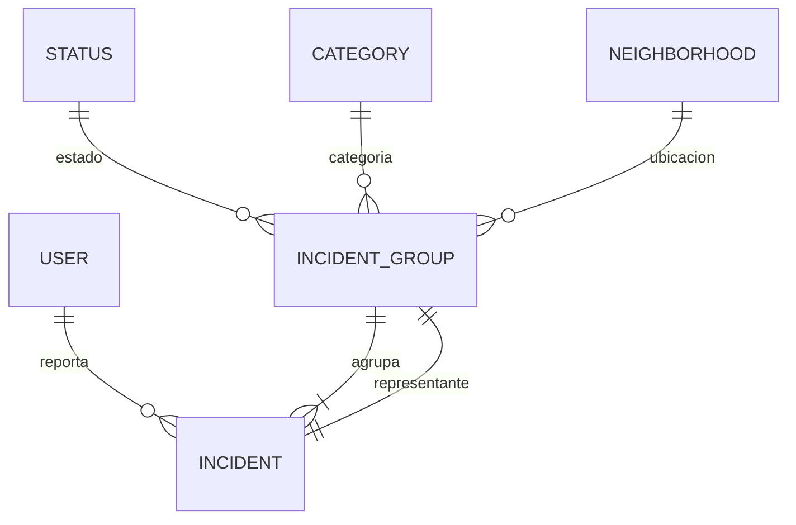
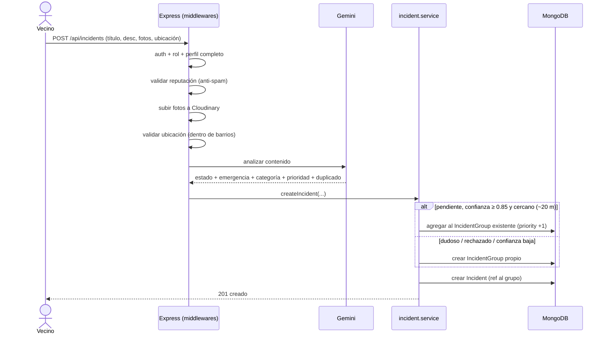

# CityFixer — Documento técnico

> Documento de estudio. Detalla **qué hace** el sistema, **con qué tecnologías**
> está construido y **por qué** se eligió cada una y cómo se aplicó. Pensado para
> entender el funcionamiento interno de la plataforma y defender las decisiones
> técnicas.
>
> Documentación complementaria (más profunda por tema):
> [arquitectura](arquitectura.md) · [autenticación](autenticacion.md) ·
> [roles y permisos](roles-permisos.md) · [flujo de estados](flujo-estados.md) ·
> [decisiones de arquitectura (ADRs)](adr/README.md).

---

## 1. Qué es CityFixer

Plataforma de **reporte y gestión de incidencias urbanas**. Tiene dos caras:

- **Ciudadano:** reporta un problema en la vía pública (bache, alumbrado, basura,
  vandalismo, etc.) con foto y ubicación en el mapa, y luego le hace seguimiento.
- **Municipio:** recibe esos reportes ya **validados, agrupados y priorizados por
  IA**, los gestiona desde un panel de administración y mide la situación de la
  ciudad con tableros y mapa de calor.

El diferencial técnico es que el sistema **no acumula reportes sueltos**: usa
inteligencia artificial para validar cada reporte, agrupar los que describen el
*mismo* problema y asignarles una prioridad objetiva antes de que lleguen a un
gestor municipal.

---

## 2. Arquitectura general

Son **dos aplicaciones** independientes que se comunican por una API REST, más
un canal de tiempo real (WebSocket) y servicios externos.

```
┌──────────────────┐        REST (axios)         ┌──────────────────────────┐
│   CityFixer       │ ─────────────────────────▶ │   BackEnd (Express 5)     │
│   (React + Vite)  │ ◀───── Socket.IO ───────── │   API + WebSocket         │
└──────────────────┘     (notificaciones)        └────────────┬─────────────┘
                                                              │
                            ┌─────────────────────────────────┼───────────────────────┐
                            ▼                ▼                 ▼            ▼            ▼
                        MongoDB           Gemini          Cloudinary     Clerk        Brevo
                       (Mongoose)        (análisis IA)     (fotos)      (login)      (email/OTP)
```

### Backend — arquitectura en capas (MVC + servicios)

Cada request entra de afuera hacia adentro y la **lógica de negocio vive en los
`services`**, no en los controllers. Esto mantiene los controllers delgados
(solo leen el request y responden) y permite testear/reusar la lógica.

| Capa | Carpeta | Responsabilidad |
|------|---------|-----------------|
| **Routes** | `routes/` | Mapear URL + método HTTP a un controller y encadenar middlewares. |
| **Middlewares** | `middlewares/` | Autenticación, verificación de rol, validaciones, subida de fotos, análisis de IA. |
| **Controllers** | `controllers/` | Leer el request, llamar al service, responder. Sin lógica de negocio. |
| **Services** | `services/` | Reglas de negocio y acceso a datos vía models. No conocen `req`/`res`. |
| **Models** | `models/` | Esquemas y validaciones de datos (Mongoose). |

> **Por qué esta separación:** desacopla la lógica del transporte HTTP. La misma
> función `createIncident` del service puede invocarse desde una ruta REST o
> reutilizarse internamente sin arrastrar el objeto `req`. Es la base para que el
> sistema escale sin convertirse en controllers de cientos de líneas.

---

## 3. Stack tecnológico y por qué cada pieza

| Capa | Tecnología | Por qué se eligió |
|------|------------|-------------------|
| Backend | **Node.js + Express 5** | Mismo lenguaje (JS) en front y back; Express es minimalista y el equipo lo domina. |
| Base de datos | **MongoDB + Mongoose** | Documentos flexibles encajan con datos heterogéneos (fotos, ubicación geo, historiales embebidos). Mongoose aporta esquema y validaciones. |
| Frontend | **React 18 + Vite** | Componentes reutilizables y SPA reactiva; Vite da arranque y HMR casi instantáneos. |
| Estilos | **Tailwind CSS + shadcn/ui + Radix** | Diseño consistente y accesible sin escribir CSS a mano; componentes headless accesibles. |
| Autenticación | **Clerk + JWT propio** | Clerk resuelve el registro/login seguro (OAuth, contraseñas); el JWT propio desacopla la API del proveedor (ver §6). |
| Tiempo real | **Socket.IO** | Notificaciones push al ciudadano cuando cambia el estado de su reporte, sin que tenga que refrescar. |
| Imágenes | **Cloudinary** | Almacenamiento y CDN de fotos fuera del servidor; URLs optimizadas. |
| IA | **Google Gemini (`gemini-2.5-flash`)** | Validación + agrupamiento + priorización en una sola llamada, con salida JSON estructurada y costo bajo (ver [ADR-004](adr/004-proveedor-de-ia-gemini.md)). |
| Mapas | **Mapbox GL + react-map-gl** | Selección de ubicación precisa y mapa de calor para la analítica municipal. |
| Email / OTP | **Brevo (API HTTP)** | Envío de códigos OTP para verificar identidad en el onboarding y el acceso externo. |
| Tableros | **Recharts** | Gráficos del panel de estadísticas del admin. |
| Documentación API | **Swagger (swagger-jsdoc + swagger-ui-express)** | Documentación interactiva autogenerada desde anotaciones `@openapi` en las rutas. |

> Nota de deuda técnica honesta: el archivo `services/openai.service.js` **usa
> Gemini, no OpenAI** (el nombre quedó del proveedor original). Documentado en
> [ADR-004](adr/004-proveedor-de-ia-gemini.md); pendiente de renombrar.

---

## 4. Modelo de datos: el corazón del diseño

La decisión arquitectural más importante: **el sistema gestiona grupos de
incidentes (`IncidentGroup`), no incidentes sueltos** (ver
[ADR-001](adr/001-incidentgroup-fuente-de-verdad.md)).

- **`Incident`** — el aporte individual e **inmutable** de cada vecino. Guarda
  título, descripción, fotos, ubicación, y el análisis de la IA para *ese*
  reporte. Siempre pertenece a un grupo (`group` es obligatorio).
- **`IncidentGroup`** — el **problema real** que gestiona el municipio. Es la
  *fuente de verdad* de `status`, `category` y `priority`. Agrupa a todos los
  incidentes que describen el mismo problema y guarda al *representante* (el
  reporte más descriptivo, elegido por la IA).



**Por qué grupos y no incidentes sueltos:** si diez vecinos reportan el mismo
bache, el municipio debe ver **un** problema (con prioridad acumulada y diez
testimonios), no diez tickets. Separar el "aporte del ciudadano" (inmutable, su
voz) de la "gestión del problema" (lo que mueve el municipio) evita que la acción
de un gestor pise el reporte original de la persona.

Otras entidades: `User`, `Role`, `Status`, `Category`, `Neighborhood` (barrios
en GeoJSON para validar que el reporte cae dentro del ejido municipal),
`Notification` y `ExternalOtp`.

---

## 5. Funcionalidades clave y cómo están implementadas

### 5.1 Reporte de un incidente (con IA en el camino)

El `POST /api/incidents` atraviesa una cadena real de middlewares antes de
crearse, cada uno con una responsabilidad única:



Cada eslabón:

1. **Autenticación + rol + perfil completo** — solo usuarios reales con perfil
   verificado pueden reportar.
2. **Reputación (anti-spam)** — `validateUserReputation`: si el usuario acumula
   **5+ incidentes dudosos** sin resolver, se le bloquea (403) hasta que un admin
   los resuelva. Frena el abuso sin necesidad de moderación manual constante.
3. **Subida de fotos** — `multer` recibe el archivo en memoria y lo sube a
   **Cloudinary**; en la base solo se guarda la URL.
4. **Validación geográfica** — `validateLocation` chequea contra
   `utils/barrios.geojson` que la ubicación cae dentro de un barrio del municipio.
5. **Análisis de IA** — el núcleo (ver §5.2).

### 5.2 Análisis con IA (Gemini) — validar, agrupar, priorizar

Una **única llamada** a `gemini-2.5-flash` (con `responseMimeType: "application/json"`
para forzar salida estructurada) resuelve cuatro cosas a la vez:

1. **Estado sugerido:** `pendiente` (válido) / `dudoso` (contradictorio o broma) /
   `rechazado` (ilegible).
2. **Emergencia:** flag separado del estado; detecta situaciones que requieren
   policía/bomberos/ambulancia.
3. **Categoría y prioridad (1–10):** la prioridad la asigna la IA por **impacto
   en la comunidad**, ignorando deliberadamente palabras como "urgente" que el
   ciudadano pueda exagerar. Hay una guía de criterios en el prompt (de "pintada
   en pared" = 1–2 a "cable eléctrico caído" = 9–10).
4. **Duplicado:** compara el reporte contra los grupos cercanos (radio ~20 m) y,
   si describe el mismo problema, devuelve `idGrupoCandidato` y un nivel de
   `confianza` (0–1).

**Regla de agrupamiento** (ver [ADR-002](adr/002-umbral-agrupamiento-ia.md)): el
reporte se anexa a un grupo existente **solo** si es `pendiente`, la `confianza
≥ 0.85` y hay proximidad geográfica (~20 m). Si no, se crea un grupo propio. Es
un umbral conservador: ante la duda, se prefiere un grupo nuevo (falso negativo)
antes que fusionar dos problemas distintos (falso positivo difícil de deshacer).

**Robustez:** la función de IA **nunca lanza una excepción**. Ante cualquier
fallo (red, cuota, JSON inválido) devuelve un objeto de contingencia
(`estado: pendiente`, `confianza: 0`) para que la caída de un servicio externo
**no impida** que el ciudadano registre su reporte. La gestión del problema nunca
queda bloqueada por la IA.

### 5.3 Máquina de estados y gestión municipal

El estado **vive en el grupo** y se gestiona con transiciones válidas
controladas (`VALID_TRANSITIONS` en `incident.service.js`):

```
pendiente → aceptado → en_proceso → resuelto
    ↘ rechazado    ↘ rechazado    ↘ rechazado
(el usuario puede cancelar desde pendiente o aceptado)
```

- Transición inválida → **409**. Estados finales (`resuelto`, `rechazado`,
  `cancelado`) **no se pueden modificar** y registran `finalizedAt`.
- Al cambiar el estado del grupo, se **propaga** a todos los incidentes no
  cancelados y se **notifica** a cada usuario afectado en tiempo real.
- **Prioridad dinámica:** sube +1 por cada reporte que se suma al grupo y baja −1
  cuando un usuario cancela el suyo. El admin puede sobreescribirla manualmente.

### 5.4 Notificaciones en tiempo real

`Socket.IO` autentica **cada conexión** con el mismo JWT de la cookie
`auth_token` y une al usuario a una *room* personal `user_<id>`. Cuando el
municipio cambia el estado de un grupo, el service crea las notificaciones en
lote (persistidas en MongoDB) y las **emite al instante** a las rooms de los
usuarios afectados. El ciudadano ve el cambio sin refrescar.

> **Por qué reutilizar el JWT en el socket:** un único modelo de identidad para
> REST y WebSocket; no hay que mantener dos sistemas de sesión.

### 5.5 Panel de administración

Construido en React (`AdminDashboard.jsx`) con pestañas:

- **Incidentes** — lista de grupos con su representante, historial, acciones de
  estado/categoría/prioridad y panel de *AI Insights* (justificación de la IA).
- **Estadísticas** — gráficos (Recharts) y **mapa de calor** (Mapbox) de la
  distribución geográfica de los problemas.
- **Categorías** y **Usuarios** — ABM de categorías y gestión de usuarios
  (esta última solo para `superAdmin`).

### 5.6 Analítica externa (Power BI)

Endpoint `GET /api/external/data/:table` pensado para que herramientas de BI
consuman los datos. **No usa Clerk ni el JWT**: el middleware `externalAuth`
exige un header `x-otp-code` (OTP de 24 h que genera un `admin`/`superAdmin`
desde la app, sección Estadísticas). Cada acceso se registra con IP y tabla
solicitada para auditoría. Ver [acceso-powerbi.md](acceso-powerbi.md) para la
guía paso a paso de conexión.

> **Por qué un esquema de auth aparte:** un dashboard de BI no tiene cookies de
> navegador ni sesión interactiva. Un OTP rotativo da acceso controlado,
> auditable y revocable sin exponer el login de usuarios.

---

## 6. Autenticación: por qué Clerk + JWT propio

Conviven **dos mecanismos** a propósito:

- **Clerk** maneja el registro/login real (formularios, contraseñas, OAuth). El
  frontend habla con Clerk y obtiene un token de Clerk.
- **JWT propio:** en el login, el backend valida el token de Clerk **una sola
  vez**, emite su propio JWT (firmado con `JWT_SECRET`, 7 días) y lo manda como
  cookie `httpOnly` `auth_token`.

A partir de ahí, **el resto de los endpoints no dependen de Clerk**: validan el
JWT propio de la cookie. Es más rápido (no hay que ir a Clerk en cada request) y
**desacopla la API del proveedor de auth** (si mañana se cambia Clerk, solo se
toca el login).

**Onboarding con OTP:** un usuario nuevo tiene `profileComplete: false` y no
puede reportar hasta cargar DNI, teléfono y dirección. La primera vez se le envía
un **OTP de 6 dígitos (10 min)** por email (Brevo) para verificar identidad. El
**DNI es único e inmutable** una vez cargado.

Detalle de los middlewares de auth en [autenticacion.md](autenticacion.md).

---

## 7. Roles y seguridad

Cuatro roles (`utils/seed.js`): `user`, `admin`, `superAdmin` y `ai` (usuario de
sistema, no es una persona: la IA lo usa como autor en el historial de estados).

Reglas de protección contra escalada de privilegios (`user.service.js`):

- No se pueden **asignar** los roles `superAdmin` ni `ai` desde la API.
- **Nadie** puede modificar el rol de un `superAdmin`.
- No podés cambiar tu propio rol ni banearte a vos mismo.
- Un usuario baneado recibe 403 en toda la API.

Matriz de permisos completa en [roles-permisos.md](roles-permisos.md).

---

## 8. Decisiones de arquitectura registradas (ADRs)

Las decisiones importantes están documentadas como ADRs para que se entienda el
*porqué*, no solo el *qué*:

| ADR | Decisión |
|-----|----------|
| [001](adr/001-incidentgroup-fuente-de-verdad.md) | `IncidentGroup` como fuente de verdad (grupos, no incidentes sueltos). |
| [002](adr/002-umbral-agrupamiento-ia.md) | Umbral de agrupamiento: confianza ≥ 0.85 + proximidad ~20 m. |
| [003](adr/003-is-dubious-como-flag.md) | `is_dubious` como *flag*, no como estado. |
| [004](adr/004-proveedor-de-ia-gemini.md) | Google Gemini como proveedor de IA. |

---

## 9. Cómo correrlo (resumen)

Dos apps, dos terminales:

```bash
# Backend
cd BackEnd && npm install
cp config/.env.example config/.env     # completar valores reales
npm run dev                            # http://localhost:3000

# Frontend
cd CityFixer && npm install
npm run dev                            # http://localhost:5173
```

API interactiva (Swagger): con el backend corriendo, **http://localhost:3000/api-docs**.
Setup detallado y variables de entorno en el [README](../README.md).

---

## 10. Resumen de fortalezas técnicas

- **Arquitectura en capas** con lógica de negocio aislada en services → mantenible
  y testeable.
- **IA como filtro de entrada**, no como adorno: valida, agrupa, prioriza y detecta
  emergencias en una sola llamada, con *fallback* que nunca bloquea al ciudadano.
- **Modelo de grupos** que refleja el problema real del municipio, no el ruido de
  reportes duplicados.
- **Tiempo real** unificado con el mismo modelo de identidad que la API REST.
- **Seguridad por capas:** doble auth, OTP en onboarding, anti-spam por reputación,
  reglas anti-escalada de privilegios y acceso externo auditable.
- **Decisiones documentadas** (ADRs) y **API autodocumentada** (Swagger).
