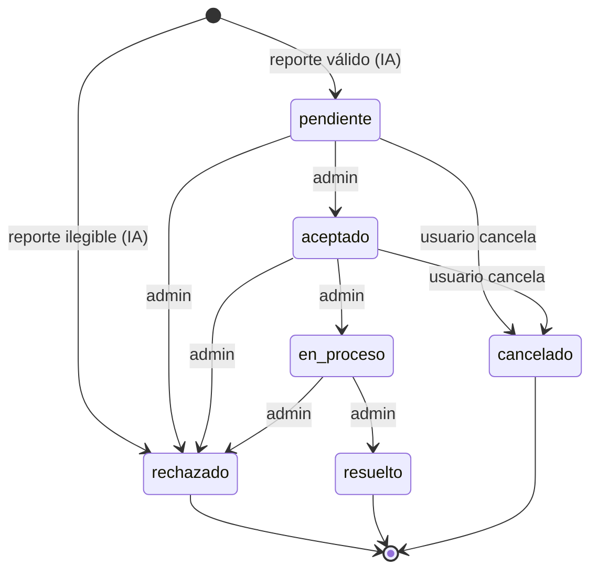

# Flujo de estados de incidentes y grupos

> Cómo cambia el estado de un problema desde que se reporta hasta que se cierra.

## Concepto clave: el estado vive en el grupo

El **estado lo gestiona el `IncidentGroup`** (ver [ADR-001](adr/001-incidentgroup-fuente-de-verdad.md)).
Cuando un admin cambia el estado del grupo, este se **propaga** a todos los
incidentes del grupo que **no estén cancelados**. El incidente individual solo
cambia de estado por su cuenta cuando el **usuario lo cancela**.

Hay **6 estados** (definidos en `utils/seed.js`):
`pendiente`, `aceptado`, `en_proceso`, `resuelto`, `rechazado`, `cancelado`.

> `dudoso` **no** es un estado: es un *flag* (`is_dubious`). Ver [ADR-003](adr/003-is-dubious-como-flag.md).

## Diagrama de estados

## Transiciones que hace el admin (sobre el grupo)

Las transiciones permitidas están en `VALID_TRANSITIONS` (`services/incident.service.js`):

| Desde | Puede pasar a |
|-------|---------------|
| `pendiente` | `aceptado`, `rechazado` |
| `aceptado` | `en_proceso`, `rechazado` |
| `en_proceso` | `resuelto`, `rechazado` |

Cualquier otra transición devuelve **409** (`No se puede pasar de "X" a "Y"`).

## Estados finales

`FINAL_STATUSES = ['rechazado', 'resuelto', 'cancelado']`.
Un grupo en estado final **no se puede modificar** (ni status, ni categoría, ni
prioridad): cualquier intento devuelve **409**. Al entrar a un estado final se
registra `finalizedAt`.

## Reglas especiales

**Grupo con incidente dudoso:** si el grupo tiene un incidente con `is_dubious`
sin resolver, el admin **solo** puede pasarlo a `aceptado` o `rechazado` (no a
`en_proceso`). Al resolverlo, se limpia el flag `is_dubious` en todos los
incidentes del grupo.

**Propagación:** al cambiar el estado del grupo, se actualiza el `status` y el
`statusHistory` de los incidentes no cancelados, y se **notifica** a cada usuario
afectado (`status_change`).

## Cancelación por el usuario

El usuario solo puede cancelar **su propio** incidente y solo si está en
`CANCELLABLE_STATUSES = ['pendiente', 'aceptado']` (de lo contrario, 409).
Al cancelar (`cancelIncident`):

1. El incidente pasa a `cancelado` y se marca `is_cancelled: true`.
2. La prioridad del grupo **baja 1** (mínimo 1).
3. Si **no quedan** incidentes activos en el grupo → el grupo pasa a `cancelado`.
4. Si el cancelado era el **representante** → se reelige otro entre los activos
   (por score título/descripción, ver [ADR-001](adr/001-incidentgroup-fuente-de-verdad.md)).

> Los incidentes con `is_cancelled: true` quedan excluidos de la propagación de
> estado del admin.
